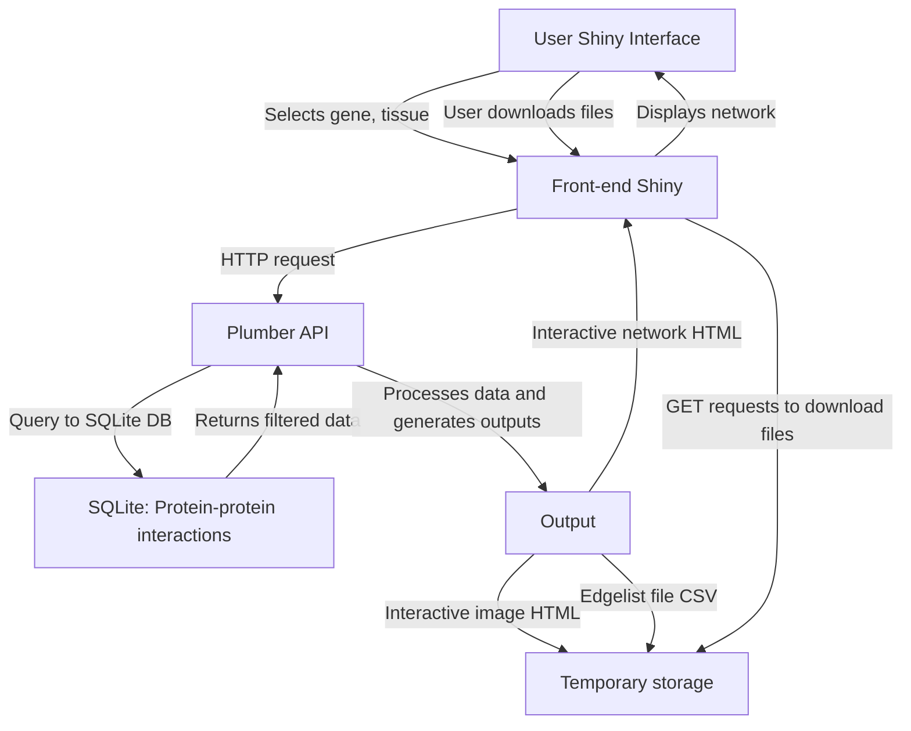

# tissuePPI-app

## Name
Tissue-specific interactome

## Description
Get a protein-protein interaction (PPI) network on the context of your target tissue. 
Chose a gene symbol and a tissue, and get the PPI Network for the protein and their interactions on the tissue selected.

The results are available as an interative network or a downloadable HTML/CSV file.

## Application diagram

## Installation

To run the application locally:
 - First create a directory
 - Download the data files to the created directory
 - Change to created directory
 - Clone de application with command: git clone 
 - Create the database with the command: sqlite3 ./dados/interacoes.sqlite < create-database.sql.
 
 Then, make sure you have docker and docker compose installed, and you only need to run
 
 `docker compose up -d`
 
And open http://localhost:3838/ in your browser of preference.

## Authors and acknowledgment
This app is authored by Julia Apolonio and Fábio Silva, with supervision of dr. Patrick Terremate and dr. Rodrigo Dalmolin
